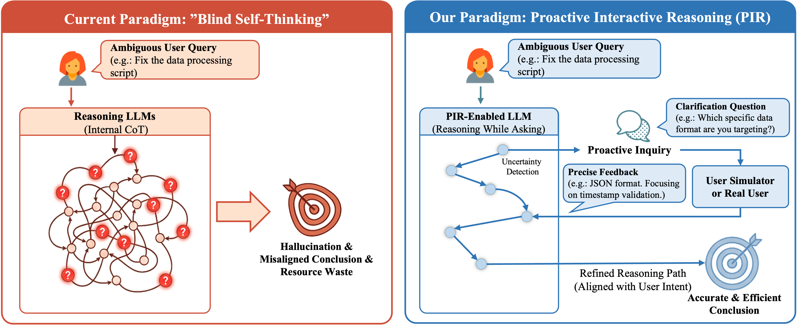

# Reasoning While Asking: Transforming Reasoning LLMs into Proactive Inquirers (PIR)

[](https://arxiv.org/abs/2601.22139)
[](https://huggingface.co/Proactive-Interactive-R1)

This repository contains the official implementation of **"Reasoning While Asking: Transforming Reasoning Large Language Models from Passive Solvers to Proactive Inquirers"**.

## 💡 Motivation

Current reasoning LLMs (e.g., GPT-o1, DeepSeek-R1) suffer from **blind self-thinking**: they perform extensive internal reasoning even when critical information is missing or user intent is ambiguous. This leads to overthinking, hallucinations, and misaligned conclusions.

**PIR (Proactive Interactive Reasoning)** is a new paradigm that transforms reasoning LLMs from passive solvers into **proactive inquirers**. Instead of guessing, PIR-enabled models detect uncertainty during reasoning and actively ask users for clarification before proceeding.

<p align="center">

</p>

### Key Features


- **User-Intent Alignment**: Optimizes interaction through US-GRPO with composite rewards balancing accuracy, efficiency, and helpfulness
- **Significant Improvements**: Up to 32.70% higher accuracy, 22.90% higher pass rate, and 41.36 BLEU improvement over baselines
- **Reduced Computation**: Nearly halves unnecessary reasoning tokens and interaction turns


## 🎮 Demo

Experience the "Reasoning While Asking" capability:

<p align="center">

</p>

1. Download the model from Hugging Face (recommended: [Proactive-Interactive-R1-Math-7B](https://huggingface.co/Proactive-Interactive-R1/Proactive-Interactive-R1-Math-7B))
2. Start the model server with vLLM
3. Run the interactive script:

```bash
python run_demo_interactive_generation.py \
    --input_file "verl-tool/datasets/mip/gsm8k.json" \
    --model_url "http://localhost:1136" \
    --model_name Proactive-Interactive-R1-Math-7B \
    --output_dir results/
```

Unlike standard reasoning LLMs that hallucinate when premises are missing, **PIR will pause reasoning to ask you for clarification**.

## 🔬 Method

PIR consists of two phases:

### Phase I: Interactive Capability Activation
- Detects uncertainty via **Predictive Entropy** at each reasoning step
- Injects clarification questions at high-uncertainty points using instruction-following LLMs
- Performs **Supervised Fine-Tuning** to teach models the "think-ask-respond" pattern

### Phase II: User-Intent Alignment
- **US-GRPO**: Group Relative Policy Optimization with a dynamic User Simulator
- **Composite Reward**: Combines output accuracy (extrinsic) with reasoning efficiency and helpfulness (intrinsic)
- Aligns model behavior with user intent while minimizing unnecessary interactions

## 🚀 Getting Started

### Installation

```bash
conda create -n pir python=3.10
conda activate pir
pip install -r requirements.txt
```


### Step 1: Uncertainty-Aware SFT (Cold Start)

Use "Reasoning-While-Asking" augmented data to fine-tune the base model:

#### Training
```bash
# Run SFT with LLaMA-Factory
llamafactory-cli train LLaMA-Factory/run/distill-qwen-7b_full_sft.yaml
```

### Step 2: User-Intent Alignment (US-GRPO)

#### Data Preparation

Data Preparation are available in `verl-tool/examples/data_preprocess/`.

#### Training

Train the SFT model using reinforcement learning with a User Simulator (Please run the user simu):

```bash
bash verl-tool/examples/train/interactive_r1/main_exp/run_train_interactive_7b_collab_math_large_us_llama-3.1-8B.sh
```

#### Training Logs

View our training experiments on [SwanLab](https://swanlab.cn/@chenx/Proactive-Interactive-R1).

## 📊 Generalization Evaluation

Evaluate on Generalization benchmarks (run detail on generalization_eval/run):

```bash
# For MIP Eval (Example)
bash generalization_eval/run_mip_eval.sh
```


## 📜 Citation

If you find this work useful, please cite our paper:

```bibtex
@misc{chen2026reasoningaskingtransformingreasoning,
      title={Reasoning While Asking: Transforming Reasoning Large Language Models from Passive Solvers to Proactive Inquirers}, 
      author={Xin Chen and Feng Jiang and Yiqian Zhang and Hardy Chen and Shuo Yan and Wenya Xie and Min Yang and Shujian Huang},
      year={2026},
      eprint={2601.22139},
      archivePrefix={arXiv},
      primaryClass={cs.CL},
      url={https://arxiv.org/abs/2601.22139},
}
```

## 🙏 Acknowledgements

We thank the teams behind [LLaMA-Factory](https://github.com/hiyouga/LlamaFactory), [verl](https://github.com/volcengine/verl), and [verl-tool](https://github.com/TIGER-AI-Lab/verl-tool) for their excellent open-source frameworks.
